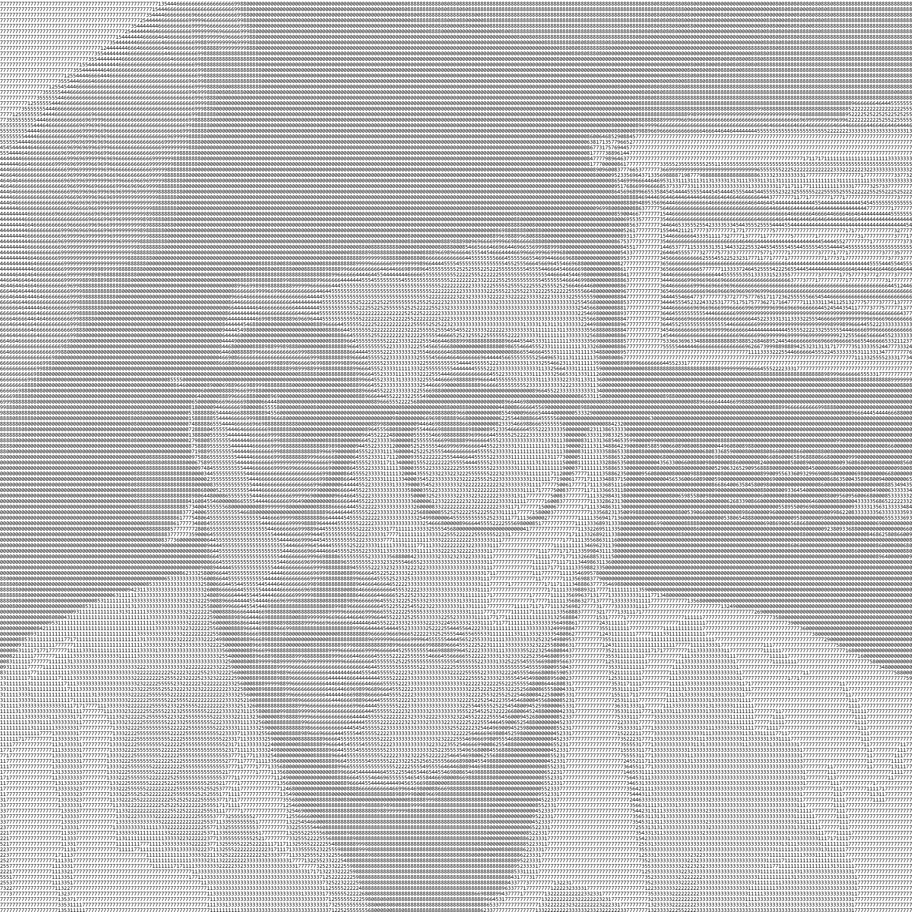

# Yassien Wasfy

**ML engineer from Cairo** working where models meet systems: implementing architectures, making them fast, and shipping them to production.

- 📖 Reading *Designing Data-Intensive Applications*, *Flunt-python*, *Fundamentals of Software Engineering*
- 📺 Enrolled *FastAPI Packet Course*
- 💬 Open to ML engineering and research roles, and freelance work

 

## Open source

**[keras-team/keras-hub](https://github.com/keras-team/keras-hub)** is Google's pretrained model library.

- Added the **BLIP-2** vision-language model ([#2699](https://github.com/keras-team/keras-hub/pull/2699)), with weight-conversion scripts and numerical-parity tests against OPT-2.7B/6.7B and Flan-T5-XL/XXL checkpoints.
- Added **KV caching** and a **Seq2SeqLM** task to T5 ([#2932](https://github.com/keras-team/keras-hub/pull/2932)), removing redundant recomputation during autoregressive decoding.
- Filed 15 issues across Keras, KerasHub and keras-io; maintainers fixed 5 of my 6 bug reports.

## Experience

**AI Engineer Intern** | Cegedim, Cairo, Egypt | Jul 2026 – Sep 2026

- Built **Octo**, a PII detection and masking pipeline combining an XLM-R model with rule-based detection that reached **98% recall** on QA documents, and integrated it into Chameleon, the company's masking software, for GDPR compliance.
- Built the shared masking engine all three team models run on, using PyMuPDF and ONNX Runtime to mask personal data in PDF and text files while keeping the original layout, with detectors for five countries' identifiers and a PP-OCRv6 fallback for scanned pages.
- Cut text processing time by **48%** and halved reference-data memory by profiling with Scalene and removing repeated file reads and per-document setup.
- Restructured the engine around rule tables and injected dependencies behind feature toggles, and added mutation testing that found gaps the passing test suite had hidden.
- Shipped to production via GitLab CI with blue/green releases, and helped build an MLflow + FastAPI setup that scored every team's model on the same synthetic data.

**Computer Vision Trainee** | NAID, New Capital, Egypt | Jul 2025 – Sep 2025

- Trained segmentation and object-detection models across the full ML lifecycle.
- Built a GAN-based model to denoise and reconstruct audio recorded in noisy environments.

## Toolkit

**Frameworks** &nbsp;

**Data** &nbsp;

**Training at scale** &nbsp;

**Deploy & optimize** &nbsp;

